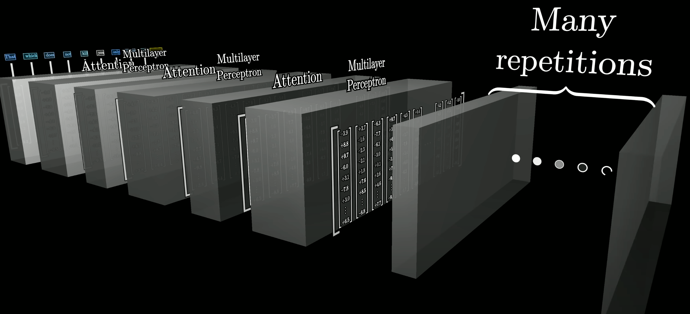

# Transformer

Mechanism of Transformer:
1. The input text is first broken into a brunch of tokens, which means little chunks that are typically words or little pieces of words. 
2. Each token is associated with a high-dimensional vector (a long list of number, GPT-3 has 12288 number) 

3. The sequence of vectors repeatly passes through two kinds of operation
   1. Attention: which allows the vectors to pass information between one another. Earlier attension block has passed information to the second  of these two vectors to ensure it encodes both name (Michal Jordan)
 
   2. MLP (Multi-layer-perceptron): Linear -> ReLU -> Linear 
   

4. certain of normalization steps in between
5. Many iteration of Attention and MLP
   
6. Each vector has soaked up enough information, both from the context(the other works in input) and also from general knowledge that was baked into the model weights through training 
7. It can make predicion of what token comes next 