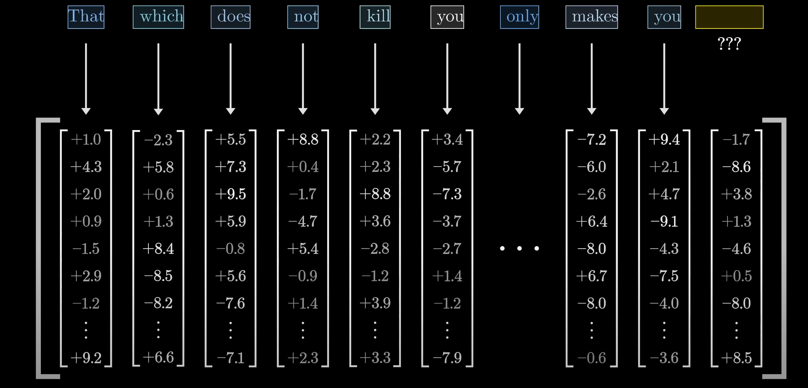
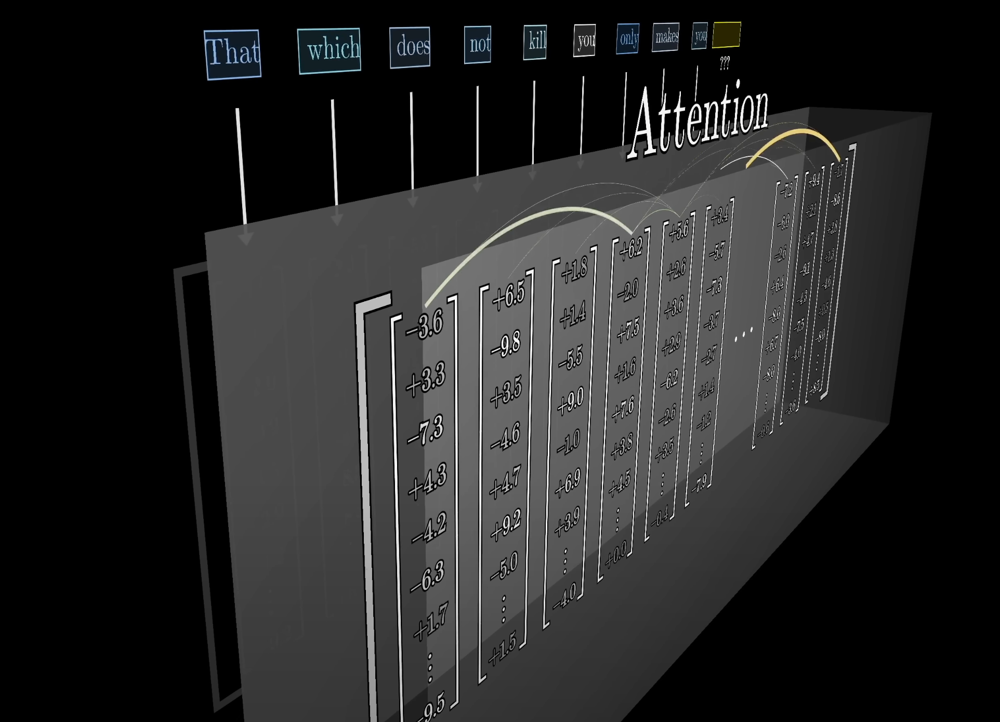
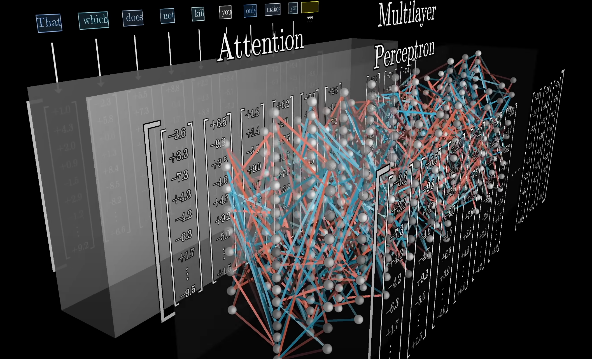

# Transformer

Mechanism of Transformer:
1. The input text is first broken into a brunch of tokens, which means little chunks that are typically words or little pieces of words. 
2. Each token is associated with a high-dimensional vector (a long list of number) 

3. The sequence of vectors repeatly passes through two kinds of operation
   1. Attention: which allows the vectors to pass information between one another 
 
   2. MLP (Multi-layer-perceptron):
   

